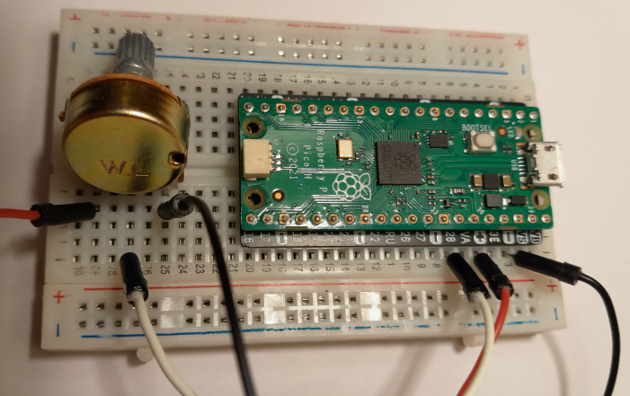

==========
Analoger Input
==========

Analog Inputs des Pi Pico
====================

Der Raspberry Pi Pico bestitzt **3 Analoge Eingänge**. Bzw. präziser müsste es heißen, dass an drei GPIO Pins durch einen integrierten 12bit *AnalogDigital Wandler* (auch ADC genannt) ein variabler Input möglich ist. 

Hardware Verkabelung
------------

Der Anschluss von Sensoren an den ADC Eingängen ist etwas komplizierter als das Anschließen eines Tasters. Bei einem **10k Poti** müssen die äußeren Beinchen jeweils an 3,3V und GROUND angeschlossen werden. Das mittlere Beinchen geht an den GPIO Pin **28** , 27 oder 26

.. literalinclude:: beispiele/Analoginput_Poti.py

Analoge Sensoren
-------------

Wie lässt sich ein anderer analoger Sensor anschließen? Zum Beispiel ein *Helligkeitssensor* (auch **LDR** = Light Dependent Resistor genannt)

Andere variable Widerstände die sich direkt an die ADCs anschließen lassen sind zum Beispiel Temperatur Sensoren oder Analoge Beschleunigungssensoren. 

