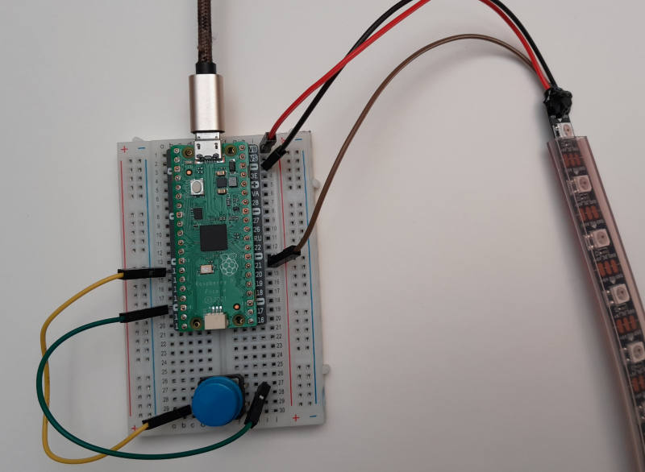

============
Digitale LED Stripe
============

Mit den sog. digitalen LED Stripes zum Beispiel den Neopixel Produkten von `Adafruit <https://www.adafruit.com/category/168>`_, lassen sich relativ einfach Farbeffekte und Animationen darstellen. Sie basieren auf der `WS2812 <https://www.elektronik-kompendium.de/sites/praxis/bauteil_ws2812.htm>`_LED mit integriertem IC. Dieser Chip kann Daten verarbeiten und in LED Licht umwandeln. Die LEDs gibt es in 5V Ausführung, sind für 3,3V Datenübertragung tolerant.

Ansteuerung der Digitalen LEDs
-------------

In Micropython ist eine Neopixel Ansteuerung enthalten. Das macht die Programmierung einfach. Die Komplexität kommt durch Fülle an Möglichkeiten. Denn es geht nun: *alle Farben* jeder einzelnen LED in unterschiedlichen *Helligkeiten*. Das ist anders als nur eine LED an und aus zu schalten. 

.. literalinclude:: beispiele/NeoPixel_Demo_einfach.py

Anschluss der Stripes
--------------

.. literalinclude:: beispiele/NeoPixel_Demo_Taster.py

------------------
Programmierungsseinschub: for-schleife
------------------