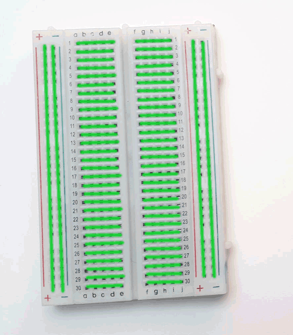

===============
Erste Schritte
===============

Die Software
===============

Einrichten der Software
------------

Um mit dem Microcontroller Raspberry Pi Pico arbeiten zu können, brauchen wir

**1.** eine *Entwicklungsumgebung* (*IDE*) auf dem Computer. Die `Thonny Python IDE`_ läuft auf Windows, Mac und Linux ist simple und übersichtlich. Einfach downloaden und installieren. 

**2.** die richtige *Firmware / Interpreter* auf dem Pi Pico Board.

.. _Thonny Python IDE: https://thonny.org/

Einrichten von Micropython auf dem Pi Pico
-------------
Auf dem Raspberry Pi Pico muss die richtige Firmware (in unserem Fall `Micropython`_ und in manchen Fällen später `Circuitpython`_) installiert werden. 

**Möglichkeit eins:** Flashen der Firmware mit Hilfe der Thonny IDE. Schritt für Schritt erklärt bei `SunFounder`_. Wenn das nicht funktioniert, dann **Möglichkeit zwei:** Manuell die `Micropython Firmware`_ als UF2 Datei auf den Raspberry Pi Pico. Achtung!! dieser muss sich dafür im `Bootloadermodus` befinden. **Dafür:** `Bootsel Taste` drücken, dann mit dem Computer via `USB Kabel` verbinden. Eine *ausführliche Anleitung* gibts `hier`_.

.. _Micropython: https://docs.micropython.org/en/latest/rp2/quickref.html
.. _Circuitpython: https://circuitpython.org/board/raspberry_pi_pico/
.. _Micropython Firmware: https://micropython.org/download/rp2-pico/rp2-pico-latest.uf2
.. _hier: https://www.raspberrypi.com/documentation/microcontrollers/micropython.html
.. _SunFounder: https://docs.sunfounder.com/projects/pico-4wd/en/latest/get_started/install_micropython_to_pico.html
.. _installationsoftware:

Das erste Programm
-------------------

Für das erste Lebenszeichen des Microcontrollers brauchst du das *Steckbrett* noch nicht, denn der Pi Pico besitzt eine *on Board LED* die du mit ein paar Zeilen Code zum Blinken bringen kannst.
Verbinde dazu den Pico mit dem USB Kabel an deinen Computer und versuche folgenden Code auf dem Board auszuführen.

.. literalinclude:: beispiele/HelloWorld.py

.. note:: 
   Probiere aus, wie eine andere LED auf dem Steckbrett zum Blinken gebracht werden kann. Wie kann sie richtig angeschlossen werden? Was muss im Code verändert werden?  

Die Hardware
===============

Neben dem Pico Board selbst gibt es andere nützliche Dinge, die dir helfen schnell ins Physicalische Prototyping zu kommen. Das **Steckbrett**, **Kabel** und diverse **Bauteile**, die du auf das Steckbrett stecken kannst. 

Das Steckbrett
-----------------

Schnell Prototyping mit der Steckplatine, auch genannt `Breadboard`.
Hier es zum |WikiSteck|

.. |WikiSteck| raw:: html

   <a href="https://de.wikipedia.org/wiki/Steckplatine" target="_blank">Wikipedia Eintrag</a> über Steckbretter. 

Die LED
--------------------

Licht emittierende Diode. Was ist das? Eine Diode ist ein elektronisches Bauteil, dass nur in eine Richtung Elektronen also Strom durchfließen lässt. Dabei entsteht bei einer LED Licht. Je nach Zusammensetzung und Bauart der LED kann dieses Licht unterschiedliche Farben haben. Daher ist eine LED nicht gleich einer LED. Wir werden hauptsächlich mit Signal leds arbeiten.