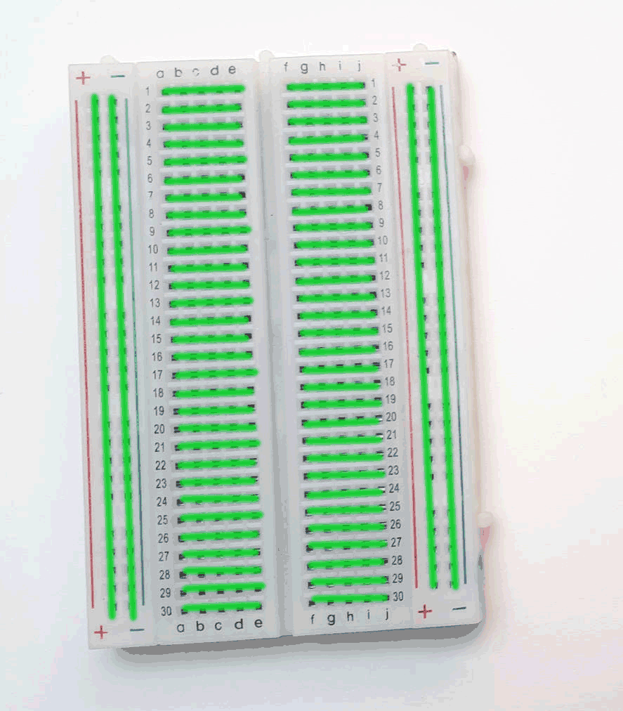

Erste Schritte
=====

.. _installationsoftware:

Einrichten der Software
------------

Um mit dem Microcontroller Pi Pico arbeiten zu können, brauchen wir eine Entwicklungsumgebung (IDE) auf dem Computer. Zum Beispiel die `Thonny Python IDE`_
läuft auf Windows, Mac und Linux.

Eine gute Anleitung, wie das geht im `Picozero Tutorial`_

.. _Picozero Tutorial: https://picozero.readthedocs.io/en/latest/gettingstarted.html#install-using-thonny
.. _Thonny Python IDE: https://thonny.org/

.. _installationMicropython:

Einrichten von Micropython auf dem Pi Pico
-------------
Auf dem Raspberry Pi Pico muss die richtige Firmware (in unserem Fall `Micropython`_ und eventuell später `Circuitpython`_) installieren. 

**Möglichkeit eins:** Flashen der Firmware mit Hilfe der Thonny IDE. Wenn das nicht funktioniert, dann
**Möglichkeit zwei:** Manuell die `Micropython Firmware`_ als UF2 Datei auf den Raspberry Pi Pico. Achtung!! dieser muss sich dafür im Bootloadermodus befinden. `Bootsel Taste` drücken, dann mit dem Computer via `USB Kabel` verbinden. Eine genauere Anleitung gibts auch `hier`_.

.. _Micropython: https://docs.micropython.org/en/latest/rp2/quickref.html
.. _Circuitpython: https://circuitpython.org/board/raspberry_pi_pico/
.. _Micropython Firmware: https://micropython.org/download/rp2-pico/rp2-pico-latest.uf2
.. _hier: https://www.raspberrypi.com/documentation/microcontrollers/micropython.html

.. _Steckbrett:

Das Steckbrett
-----------------

Schnell Prototyping mit dem Steckplatine auch genannt `Breadboard`
Oder geht es hier zum |WikiSteck|

.. |WikiSteck| raw:: html

   <a href="https://de.wikipedia.org/wiki/Steckplatine" target="_blank">Wikipedia Eintrag</a> über Steckbretter. 

.. _HelloWorld:

Das erste Programm
-------------------

Das erste Lebenszeichen des Microcontrollers. Bringe ihn zum Blinken der Onboard LED. Zunächst ohne Steckbrett einfach nur mit dem USB Kabel am Computer.

.. literalinclude:: beispiele/HelloWorld.py

