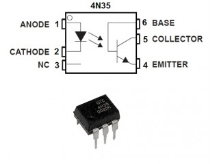
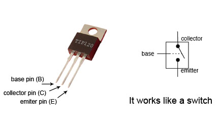
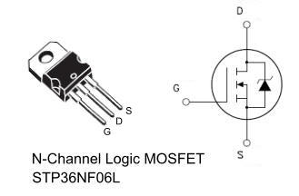
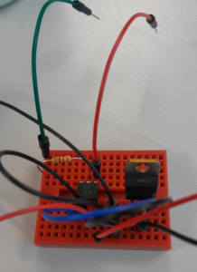
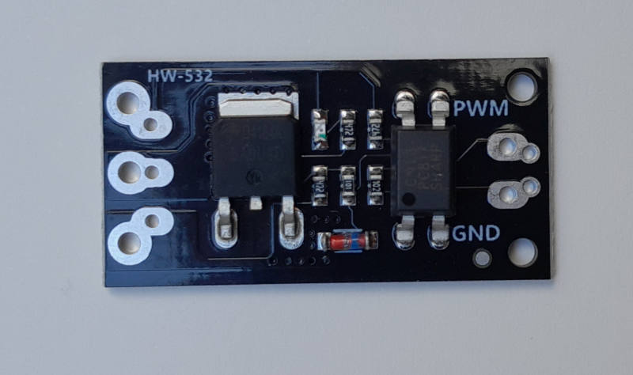
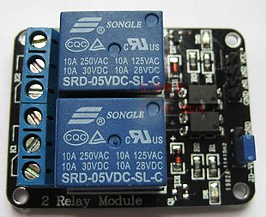
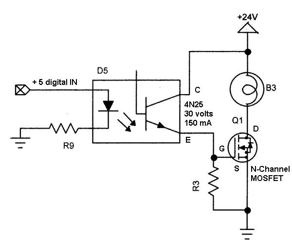

==========
Höhere Lasten
==========

.. warning:: 
	Achtung! Hier wird mit externen Stromquellen gearbeitet. Bei falscher Verkabelung, kann das zur **Zerstörung** des Microcontrollers oder auch eines daran (per USB Kabel) angeschlossenen Computers führen!!!

Elektronischer Background
------------
Wie können wir höhere Ströme und Verbraucher mit einem Microcontroller steuern. Dazu braucht es weitere Bauteile. Es geht um die Trennung von *Steuer*- und *Arbeitsstromkreis*. Dabei hilft ein sog. Optokoppler. Zum Beispiel ein 4N35:

Dieses Bauteil trennt zwei Stromkreise voneinander indem es Signal mit Hilfe von Licht (LED) an einen Fototransistor weitergibt. 

Als Verstärkung oder Schalter kann dann zum Beispiel ein TIP 120 Transistor verwendet werden. 

Ein `MOSFET <https://www.youtube.com/watch?v=JTFTsVKR_00>`_ funktioniert ähnlich. Aber Achtung bei der **Pinbelegung** 

Der Vorteil gegenüber einem Relais ist, dass auch PWM Signale verarbeitet werden können. Da die Reaktionszeit eines Transistors viel schneller sind. Somit ist das Dimmen von LEDs oder das Regeln von Geschwindigkeiten bei Motoren damit möglich. 

Shield vs. Selber bauen
------------
Eigenbau

HW-532

Relais Shield

Aufbau der Schaltung
-------------

N-Channel Mosfet Schaltung: R9 ist ein 220 Ohm Vorwiderstand für den Anschluss direkt an einen GPIO Pin des Raspberry Pi Pico. 

https://www.youtube.com/watch?v=eqXaqRFAWrA

