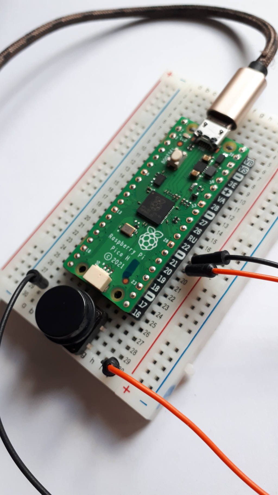

Der erste Input
==========

Eine LED können wir zum blinken bringen. Aber wie gelingt es die LED per *Knopfdruck* anzusteuern. Mit Hilfe eines **Tasters** (auch Button genannt)

Der Button alias Taster
------------

Ein *Taster* ist ein elektrisches Schalter. Anders jedoch als ein bistabiler *Schalter* (Switch) schaltet der Taster nur bei gedrücktem Knopf, wird los gelassen ist auch der Durchgangskontakt wieder unterbrochen.  

Bildquelle: https://elinux.org/Minnowboard:Physical_Computing

Anschluss an den Pico
-------------
Wir schließen den Taster an den Pin 21 und an GND (Ground) auf dem Pico Board an.

Der große Button mit 4 Beinchen (wie auf dem Bild) ist etwas schwer ins Steckbrett zu bekommen, da die Beine relativ dick sind. Es gibt auch kleinere Taster und solche mit 2 Pins.

Das Input Programm
----------------
Durch den Tastendruck wird mit diesem Programm die LED auf dem Pi Pico gesteuert.

.. literalinclude:: beispiele/Input_Taster.py

.. warning:: 
    Alles neu?! Keine Panik. Es wird noch Schritt für Schritt erklärt, was im Code passiert und welche Befehle für was zuständig sind. **Gerade ist erstmal interessant, dass in der physikalischen Welt durch den Code d.h. die Ausführung des Programms auf dem Microcontroller etwas passiert.**

Eine Schaltung 1000 Möglichkeiten
-----------------
Ein simpler Aufbau. Ein paar Zeilen Code und schon können wir Dinge (in diesem Fall erstmal die Onboard LED) steuern. Wie lässt sich nun der Code so verändern, dass andere Dinge beim Tastendruck passieren? 

.. note:: 
    Wie lässt sich der Code so weiterentwickeln, dass die LED 2 x blinkt und dann erst wieder aus geht nachdem der Taster betätigt wurde???

