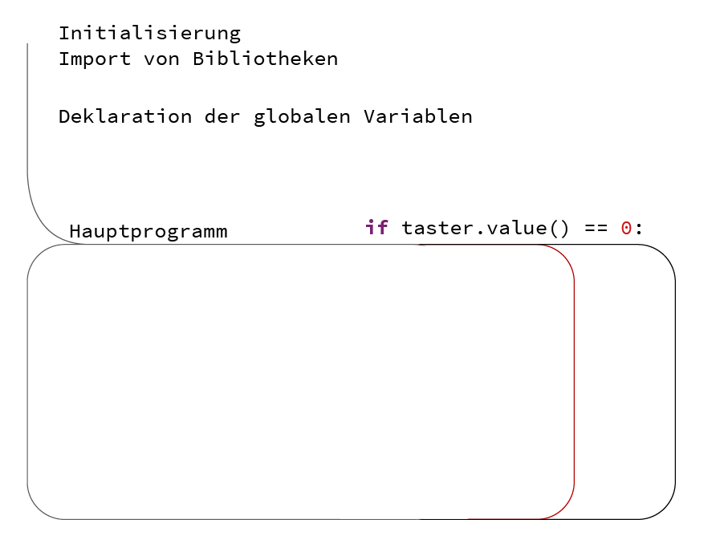

=============
Über Programmierung
=============

Von Schleifen und Wahrheitswerten über Wenn / Dann Strukturen - alles ist Programmierung. Bilder wie die eines Gleissystems mit Weichen und einem Zug der im Kreis fährt, helfen die abstrakte Logik zu verstehen.

Erklärungsansätze Programmierung
================

**Programmieren ist wie Kuchenbacken**

Ähnlich wie der Computer bzw. Microcontroller klare Anweisungen im Code braucht, um das Programm auszuführen, so braucht auch das Backen eines leckeren Kuchens ein klares und verständliches Rezept.

.. sourcecode::
    #Zutaten
    Zucker = 100
    Mehl = 200
    Eier = 3
    SchokoStreusel = viele

    while True:
        Zutaten_Mixen()
        if BackofenTemperatur >= 180:
            Kuchen_in_den_Ofen()
            time.sleep(300000)
Höhere Programmiersprachen ermöglichen uns, die Maschinensprache die der Computer versteht für uns verständlich zu machen. Bevor wir einen Kuchen backen ist es allerdings sinnvoll

Die if-Bedingung
================

.. image:: bilder/IF-THEN-ELSE_flowchart.png
    :alt: Programmschema einer if Bedingung

Quelle: Von Vectorized by Snubcube based on https://commons.wikimedia.org/wiki/File:IF-THEN-ELSE-END_flowchart.png - Eigenes Werk, CC BY-SA 3.0

.. sourcecode::

    if(a => 0):     # Wenn a größer gleich 0 ist, dann...
    elif(b == 1):   # oder wenn b genau 1 ist, dann...
    else:           # Alles andere (nichts trifft zu)

    if price < 100:
        print(„price weniger als 100“)   

    if price > 100:
        print(„price ist mehr als 100“)  

    if price == 100:
        print(„price ist genau 100“)

Boolesche Operatoren in der if Bedingung
---------------------------

.. note::

    *Auszug aus Wikipedia*: Boolesche Operatoren werden beispielsweise im Bereich der Programmierung verwendet. Die gebräuchlichsten dieser Operatoren sind der UND- (Konjunktion), ODER- (Disjunktion), NICHT- (Negation).
    Quelle: https://de.wikipedia.org/wiki/Boolescher_Operator

.. sourcecode:: 
    if price < 100 and price > 50:
        print(„price zwischen 100 und 50“)   

    if price < 100 not angebot == True:     
        print(„price unter 100 ohne Angebot“)   

        and (logical und)
        or (logical oder)
        not  (für nicht)

Alles über die **if Abfrage in Python**: 
https://www.python-lernen.de/if-abfrage-python.htm

Die Programmstruktur
-----------------

