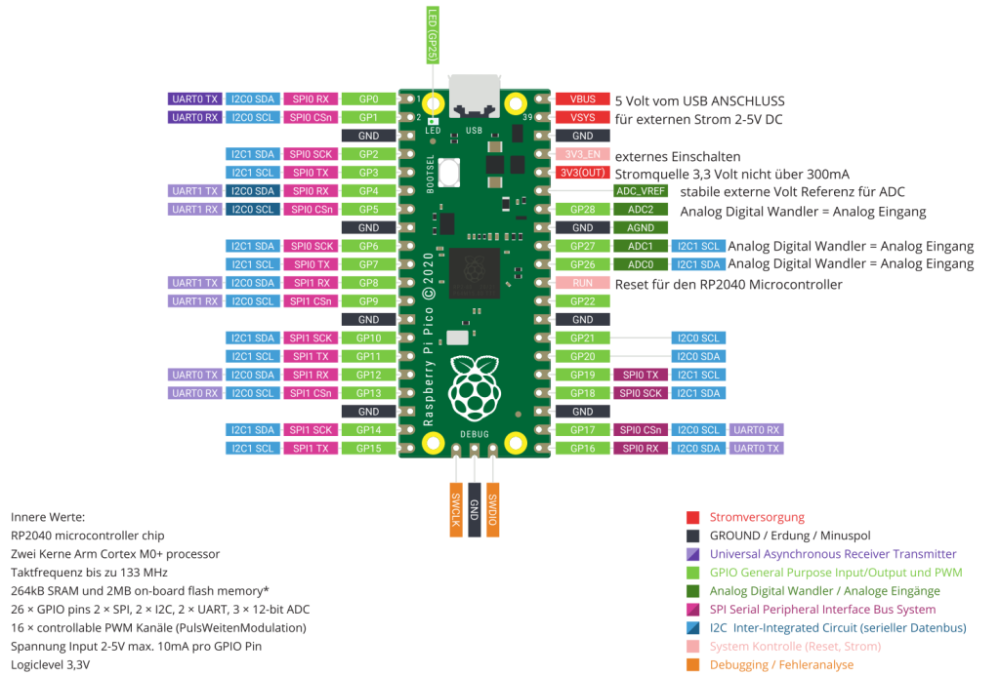
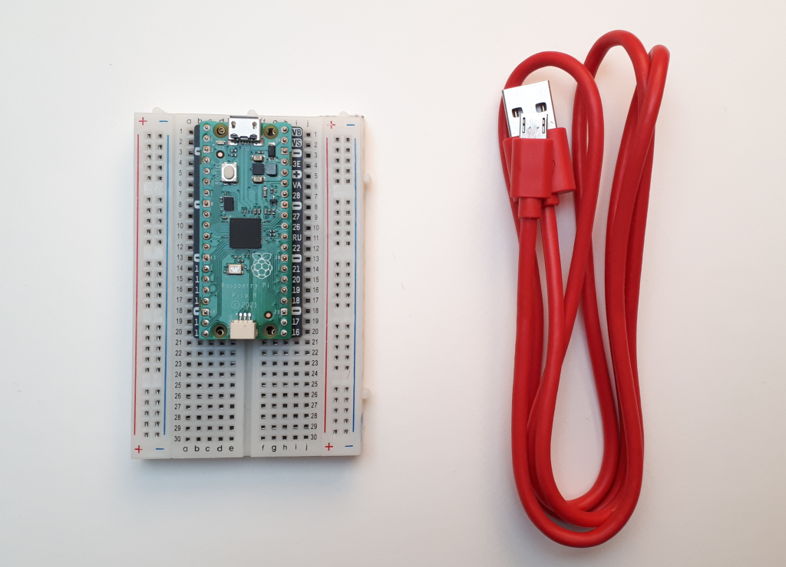

Der Raspberry Pi Pico
===============

Das Pin Out des Raspberry Pi Pico
----------------

Die Pin Belegung des Picos. Welcher Pin ist für was? Hier das `Pico Pinout`_ auch als interaktive Webanwendung finden. 

.. _Pico Pinout: https://pico.pinout.xyz/

Der RP2040 Chip
-----------------

Der `RP2040`_ Chip von der Raspberry Pi Foundation 2021 entworfen und entwickelt, bildet das Herzstück für den Raspberry Pi Pico Microcontroller.

.. _RP2040: https://de.wikipedia.org/wiki/RP2040

   
+------------------------+----------------------------------+
| Bezeichnung            | Spezifikation                    |
+========================+==================================+
| Prozessor              | Zwei Kerne Arm Cortex M0+        |
+------------------------+----------------------------------+
| Taktfrequenz           | bis zu 133 MHz                   |
+------------------------+----------------------------------+
| Flashspeicher          | 264 kB SRAM                      |
|                        | 2 MB on-board Flashspeicher      |
+------------------------+----------------------------------+
| Input/Output Pins      | 26 × GPIO Pins                   |
|                        | 2 × SPI, 2 × I2C, 2 × UART       |    
|                        | 3 × 12-bit AnalogDigital Wandler |
+------------------------+----------------------------------+
| Stromversorgung        | Spannung Input 2-5,5 V DC        |
+------------------------+----------------------------------+
| Arbeitsspannung        | 3,3 Volt max 10mA pro GPIO Pin   |
+------------------------+----------------------------------+ 
| Besonderheiten         | Temperatursensor, onBoard LED,   |
|                        | Debugging Schnittstelle          |
+------------------------+----------------------------------+          
   

.. note:: 
    siehe dazu auch die ausführliche Beschreibung im Elektronik Kompendium zum Thema `Raspberry Pi Pico <https://www.elektronik-kompendium.de/sites/raspberry-pi/2604131.htm>`_ oder direkt auf der `Raspberry Pi Pico Dokumentation <https://www.raspberrypi.com/documentation/microcontrollers/raspberry-pi-pico.html>`_

Das Startset: Raspberry Pi Pico auf Steckbrett und USB Kabel.

Zwischen Pi Pico und dem Steckbrett befindet sich eine `Pi Pico Proto <https://www.berrybase.de/raspberry-pi-pico-proto>`_ beschriftete Lochraster Platine. Damit sind die richtigen Pins leichter zu finden.

